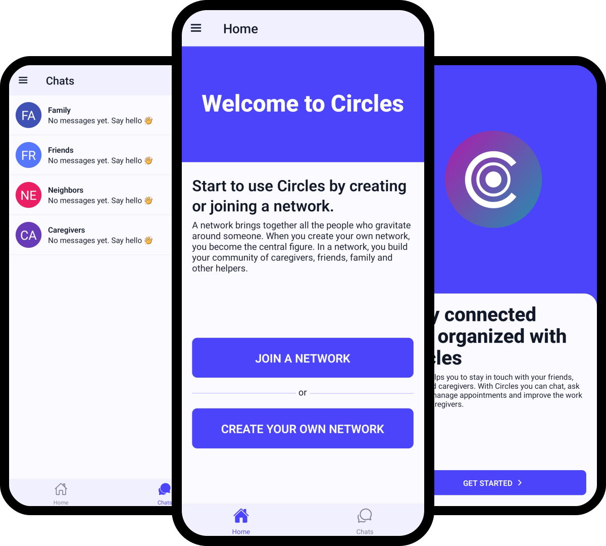

# Circles

[](https://github.com/Mathieu-COSYNS-Student/circles/actions/workflows/ci.yml)




## About

This repository contains the source code of Circles. Circles is an app that we developed for our master thesis during our last year at Université catholique de Louvain.

## Repository structure

Circles uses [Turborepo](https://turborepo.org/) and contains:

```
.github
  └─ workflows
      └─ CI
.vscode
  └─ Recommended extensions and settings for VSCode users
apps
  ├─ expo
  |   ├─ Expo SDK 48
  |   ├─ React Native using React 18
  |   ├─ Navigation using reactnavigation
  |   ├─ Tailwind using Nativewind
  |   ├─ Typesafe API calls using tRPC
  |   └─ Clerk authentication
  └─ next.js
      ├─ Next.js 13
      ├─ React 18
      ├─ Tailwind CSS
      ├─ E2E Typesafe API Server & Client
      └─ Clerk authentication
packages
  ├─ accesscontrol
  |   └─ Library to ensure users permissions on resources
  ├─ api
  |   └─ tRPC v10 router definition
  ├─ db
  |   └─ Typesafe db-calls using Prisma
  └─ schema
      └─ zod schema and Typescript definition
```

## Quick Start

To get it running, follow the steps below:

### Setup a Firebase project

1. Create a new Firebase project at https://firebase.google.com
1. ...

### Setup a Clerk application

1. Create an account at https://clerk.com/ if you do not already have one
1. Create a Clerk application
1. Link Clerk with Firebase in the dashboard
1. In the Clerk dashboard you can find environment variables for your project

### Setup dependencies

```diff
# Install dependencies
npm i

# Configure environment variables.
# There is an `.env.example` in the root directory you can use for reference
cp .env.example .env

# Push the Prisma schema to your database
npm run db:push
```

### Configure Expo `dev`-script

#### For Android

1. Install Android Studio tools [as shown on expo docs](https://docs.expo.dev/workflow/android-studio-emulator/).
2. Run `npm dev` in the `apps/expo` folder.

## Deployment

### Next.js

#### Prerequisites

- A MongoDB

**Please note that the Next.js application with tRPC must be deployed in order for the Expo app to communicate with the server in a production environment.**

#### Deploy to Vercel

Let's deploy the Next.js application to [Vercel](https://vercel.com/). If you have ever deployed a Turborepo app there, the steps are quite straightforward. You can also read the [official Turborepo guide](https://vercel.com/docs/concepts/monorepos/turborepo) on deploying to Vercel.

1. Create a new project on Vercel, select the `apps/nextjs` folder as the root directory and apply the following build command:

   ```sh
   cd ../.. && npx turbo run build --filter=nextjs
   ```

2. Add your environment variables.

3. Done! Your app should successfully deploy. Assign your domain and use that instead of `localhost` for the `url` in the Expo app so that your Expo app can communicate with your backend when you are not in development.

### Expo

Deploying your Expo application works slightly differently compared to Next.js on the web. Instead of "deploying" your app online, you need to submit production builds of your app to the app stores, like [Apple App Store](https://www.apple.com/app-store/) and [Google Play](https://play.google.com/store/apps). You can read the full [Distributing your app](https://docs.expo.dev/distribution/introduction/), including best practices, in the Expo docs.

1. Modify `apps/expo/app.json` with your name and identifiers.

1. Make sure to modify the `extra.prodServerBaseUrl` in `apps/expo/app.json` to point to your backend's production URL.

1. Let's start by setting up [EAS Build](https://docs.expo.dev/build/introduction/), which is short for Expo Application Services. The build service helps you create builds of your app, without requiring a full native development setup. The commands below are a summary of [Creating your first build](https://docs.expo.dev/build/setup/).

   ```bash
   // Install the EAS CLI
   $ npm add -g eas-cli

   // Log in with your Expo account
   $ eas login

   // Configure your Expo app
   $ cd apps/expo
   $ eas build:configure
   ```

1. After the initial setup, you can create your first build. You can build for Android and use different [**eas.json** build profiles](https://docs.expo.dev/build-reference/eas-json/) to create production builds or development, or test builds. Let's make a production build for Android.

   ```
   $ eas build --platform android --profile production
   ```

   > If you don't specify the `--profile` flag, EAS uses the `production` profile by default.

1. Now that you have your first production build, you can submit this to the stores. [EAS Submit](https://docs.expo.dev/submit/introduction/) can help you send the build to the stores.

   ```
   $ eas submit --platform android --latest
   ```

   > You can also combine build and submit in a single command, using `eas build ... --auto-submit`.

1. Before you can get your app in the hands of your users, you'll have to provide additional information to the app stores. This includes screenshots, app information, privacy policies, etc. _While still in preview_, [EAS Metadata](https://docs.expo.dev/eas/metadata/) can help you with most of this information.

1. Once everything is approved, your users can finally enjoy your app. Let's say you spotted a small typo; you'll have to create a new build, submit it to the stores, and wait for approval before you can resolve this issue. In these cases, you can use EAS Update to quickly send a small bugfix to your users without going through this long process. Let's start by setting up EAS Update.

   The steps below summarize the [Getting started with EAS Update](https://docs.expo.dev/eas-update/getting-started/#configure-your-project) guide.

   ```bash
   // Add the `expo-updates` library to your Expo app
   $ cd apps/expo
   $ npm install expo-updates

   // Configure EAS Update
   $ eas update:configure
   ```

1. Before we can send out updates to your app, you have to create a new build and submit it to the app stores. For every change that includes native APIs, you have to rebuild the app and submit the update to the app stores. See steps 2 and 3.

1. Now that everything is ready for updates, let's create a new update for `production` builds. With the `--auto` flag, EAS Update uses your current git branch name and commit message for this update. See [How EAS Update works](https://docs.expo.dev/eas-update/how-eas-update-works/#publishing-an-update) for more information.

   ```bash
   $ cd apps/expo
   $ eas update --auto
   ```

   > Your OTA (Over The Air) updates must always follow the app store's rules. You can't change your app's primary functionality without getting app store approval. But this is a fast way to update your app for minor changes and bug fixes.

1. Done! Now that you have created your production build, submitted it to the stores, and installed EAS Update, you are ready for anything!

## References

The stack originates from [create-t3-turbo](https://github.com/t3-oss/create-t3-turbo).
